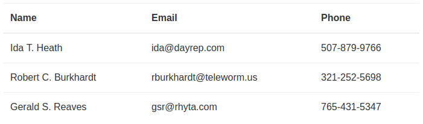

# Simple ``Matreshka.Array`` class example



This example explains a purpose of [Matreshka.Array](https://matreshka.io/#!Matreshka.Array). Before reading you need to be familiar with ``Matreshka.Object``. A short tutorial [lives there](https://github.com/matreshkajs/examples/tree/master/matreshka-object).

Let’s say the task is to display the list of some people as a table. So as not to make the example more complicated, let’s place the prepared data into ``data`` variable.

```js
// randomly generated names and phones
const data = [{
        name: 'Ida T. Heath',
        email: 'ida@dayrep.com',
        phone: '507-879-9766'
    }, {
        name: 'Robert C. Burkhardt',
        email: 'rburkhardt@teleworm.us',
        phone: '321-252-5698'
    }, {
        name: 'Gerald S. Reaves',
        email: 'gsr@rhyta.com',
        phone: '765-431-5347'
}];
```

At the beginning, as usual, let’s create HTML layout.

```html
<table class="users">
  <thead>
    <th>Name</th>
    <th>Email</th>
    <th>Phone</th>
  </thead>
  <tbody><!-- the list of users will be here --></tbody>
</table>
```

Declare Users collection which is inherited from ``Matreshka.Array``.

```js
class Users extends Matreshka.Array {

}
```

Set ``"itemRenderer"`` property which is responsible for the way the elements of the array will be rendered on the page.

```js
get itemRenderer() {
    return '#user_template';
}
```

In this case, the selector, referring to a template in HTML code, has been given as a value.

```html
<script type="text/html" id="user_template">
 <tr>
   <td class="name"></td>
   <td class="email"></td>
   <td class="phone"></td>
  </tr>
</script>
```

> ``itemRenderer`` property can get other values, including function or HTML string.

And set the value of Model property, defining the class of elements which are contained in the collection.

```js
get Model() {
    return User;
}
```

We will create ``User`` class a bit later, let’s define the constructor of the newly-created collection class first.

```js
constructor(data) {
    super();
    this
        .bindNode("sandbox", ".users")
        .bindNode("container", ":sandbox tbody")
        .recreate(data);
}
```

While creating the instance class:

- ``sandbox`` property is bound to ``.users`` element creating a sandbox (class boundary effect on HTML).
- ``container`` property is bound to ``:sandbox tbody`` element determining HTML node where the rendered array items will be inserted into.
- add the passed data to the array with the help of [recreate](https://matreshka.io/#!Matreshka.Array-recreate) method.

That's good enough. But we're going to use all the awesomeness of ECMASCript 2015 and we're going to use ``super`` call to fill the collection with passed data.

```js
constructor(data) {
    super(...data)
        .bindNode('sandbox', '.users')
        .bindNode('container', ':sandbox tbody')
        .rerender();
}
```
- Add new items to the collecton via ``super`` call (which does the same as ``Matreshka.Array.apply(this, data)`` would do).
- ``sandbox`` property is bound to ``.users`` element creating a sandbox.
- ``container`` property is bound to ``:sandbox tbody`` element.
- add the passed data to the array with the help of [recreate](https://matreshka.io/#!Matreshka.Array-recreate) method.
- Call [rerender](https://matreshka.io/#!Matreshka.Array-rerender) method to render the collection (since we've bound ``container`` later than added new items).

Now declare a "model". ``User`` class is inherited from the familiar ``Matreshka.Object``.

```js
class User extends Matreshka.Object {
  constructor(data) { ... }
}
```

**... coming soon**
