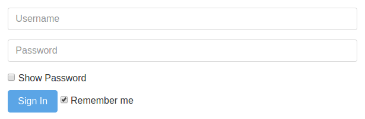

# ``Matreshka.Object`` class example



This example explains a purpose of [Matreshka.Object](https://matreshka.io/#!Matreshka.Object). We're going to implement a simple login form with two text fields: login and password and two checkboxes: «show password» and «remember me». There’s also one button: «sign in». Let’s say that the validation of the form is passed when the login length is not less than 4 characters and the password one is not less than 5 characters.

[**Demo**](https://matreshkajs.github.io/examples/matreshka-object/)

A little theory: ``Matreshka.Object`` plays the role of the class which creates objects of a key-value type. In each class instance **properties which are responsible for data** (the ones that will be passed to a server, for example) can be separated from other properties (the ones that the server doesn’t need but define the application behavior). In this case, login, password and “remember me” are the data which we send to the server, but the property that defines if the form is valid is not passed.

You can find more detailed information about this class [in the documentation](https://matreshka.io/#!Matreshka.Object).

So, let’s create a class which is inherited from ``Matreshka.Object``.

```js
class LoginForm extends Matreshka.Object {
    constructor () {
        // ...
    }
}
```

As the application is very small, all logic can be placed in the class constructor.

First of all, let’s declare default data.

```js
super();

this.setData({
    userName: '',
    password: '',
    rememberMe: true
})
```

[setData](https://matreshka.io/#!Matreshka.Object-setData) method does not only sets values but it also declares properties which are responsible for the data. That is "userName", "password" and "rememberMe" must be passed to the server (in this example we will just print JSON on the screen).

Since Matreshka.js recommends to use all the awesomeness of ECMAScript 2015 and since ``Matreshka.Object`` constructor calls ``setData`` internally, we're going to put the default data to a single ``super`` call (which does the same as ``Matreshka.Object.call(this, { ... })`` would do) to make our code look nicer. The following code makes the same as the previous one.

```js
super({
    userName: '',
    password: '',
    rememberMe: true
})
```

> ``super`` calls always return current context (``this``) so we can chain method calls.

Let’s declare "isValid" property which depends on "userName" and "password" properties. On changing any of these properties, "isValid" property will also be changed.

```js
.calc('isValid', ['userName', 'password'], (userName, password) => {
    return userName.length >= 4 && password.length >= 5;
})
```

"isValid" will equal ``true``, if the length of a user’s name is not less than four characters and the length of a password — five. [calc](https://matreshka.io/#!Matreshka-calc) method is another cool feature of the framework. Some properties can depend on other ones which depend on the third ones and the third ones can totally depend on the properties of some other object. Meanwhile, you are protected from the iterative references. The method stops a cycle if there are dangerous dependencies.

Now let’s bind the object properties to the elements on the page. First, declare a ``"sandbox"``. The “sandbox” is necessary for restricting the instance influence by one element on the page and avoiding collisions with other objects (for example, if there are two elements with the same class on the page). Next bind the other elements.

[bindNode](https://matreshka.io/#!Matreshka-bindNode) method is responsible for two way data binding.

```js
// alternative syntax of the method allows to pass a key-element
// object as the first argument,
// it reduces the code quantity a bit
.bindNode({
    sandbox: '.login-form',
    userName: ':sandbox .user-name',
    password: ':sandbox .password',
    showPassword: ':sandbox .show-password',
    rememberMe: ':sandbox .remember-me'
})
```

As you see, for the other elements a nonstandard ``:sandbox`` selector is used, which refers to the sandbox (to the element with ``login-form`` class name). In this case it isn’t obligatory as the page contains only our form. Otherwise, if there are a few forms or other widgets on the page, it is strongly recommended to restrict chosen elements such way.

Then bind the button which is responsible for the form submission to ``"isValid"`` property. When ``"isValid"`` equals ``true``, add ``"disabled"`` class name to the element, when it equals ``false`` — remove it. This is an example of the one-way binder, i. e. the object property value influences the state of HTML element, but not vice versa.

```js
.bindNode("isValid", ":sandbox .submit", {
    setValue(v) {
        this.classList.toggle("disabled", !v);
    }
})
```

Instead of the above notation, you can use a shorter one using built-in [className binder](https://matreshka.io/#!Matreshka.binders.className):

```js
.bindNode('isValid', ':sandbox .submit',
    Matreshka.binders.className('disabled', false))
```

See the documentation for [binders](https://matreshka.io/#!Matreshka.binders) object.

Bind the password field to the ``"showPassword"`` property and change the input type depending on the property value (``:bound(KEY)`` is the last non-standard selector).

```js
.bindNode("showPassword", ":bound(password)", {
    getValue: null,
    setValue(v) {
        this.type = v ? "text" : "password";
    }
})
```

``getValue: null`` means that we override the standard framework behavior on binding the form elements.

Add the form submission event.

```js
.on("submit::sandbox", evt => {
    this.login();
    evt.preventDefault();
})
```

``"submit"`` is an ordinary DOM or jQuery event (is jQuery is used), sandbox is our form (``".login-form"``). Such an event and a key must be separated by the double colon. This is syntactic sugar of DOM events, i. e. the event can be added in any other way:

```js
this.nodes.sandbox.addEventListener("submit", evt => { ... });
```

In the handler we call ``login`` method, which will be declared below and we prevent the reloading of the page, canceling the browser standard behaviour by using ``preventDefault``.

The final touch is ``login`` method. For this example, the method displays the resulting object on the screen if the form is valid. In the real application the function content must obviously be ajax request to the server.

```js
login() {
    if(this.isValid) {
        alert(JSON.stringify(this));
    }

    return this;
}
```

In the end we create a class instance.

```js
const loginForm = new LoginForm();
```

You can open the console again and change properties manually:

```js
loginForm.userName = "Chuck Norris";
loginForm.password = "roundhouse_kick";
loginForm.showPassword = true;
```

Further reading: [Matreshka.Array](https://github.com/matreshkajs/examples/tree/master/matreshka-array)
